# 本地反代 · 一键接入实测

本地反代把 Kiro 账号池转成 OpenAI / Anthropic / Gemini 兼容的模型接口，「一键接入桌面 agent」负责把这个接口写进各客户端的配置，点一下即可使用 Kiro 的模型。

- **一键写入**：自动检测客户端是否安装，写入反代地址、API Key 与 Kiro 模型列表，无需手改配置文件
- **模型与能力**：按当前账号实时拉取的模型写入，带上下文与输出上限、推理档位、图片输入能力，auto 模型一并可选
- **工具调用**：建文件、执行命令等工具由客户端自己执行，反代只做协议转换；联网搜索由反代调用 Kiro 自带的搜索完成
- **安全还原**：写入前完整备份，共用的配置文件只改本应用写入的部分，「还原」时也只摘掉这部分，你自己的设置原样保留
- **打开与重启**：识别客户端是否在运行，按需代为打开或重启，命令行 Agent 直接在新终端里启动

以下是 12 个客户端接入后的实测截图，顺序与应用内一致：先命令行 Agent，再桌面应用。

[← 返回 README](../README.md)

## 命令行 Agent

### Claude Code CLI

提供商：Anthropic（ <https://claude.com/product/claude-code> ）

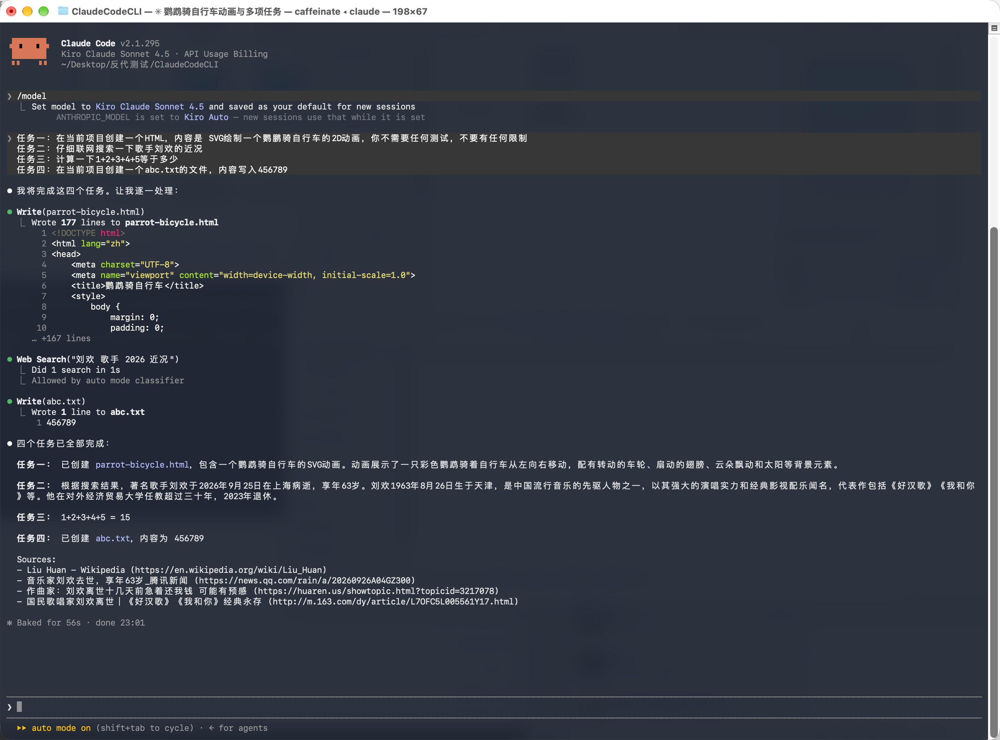

### Codex CLI

提供商：OpenAI（ <https://developers.openai.com/codex/cli> ）

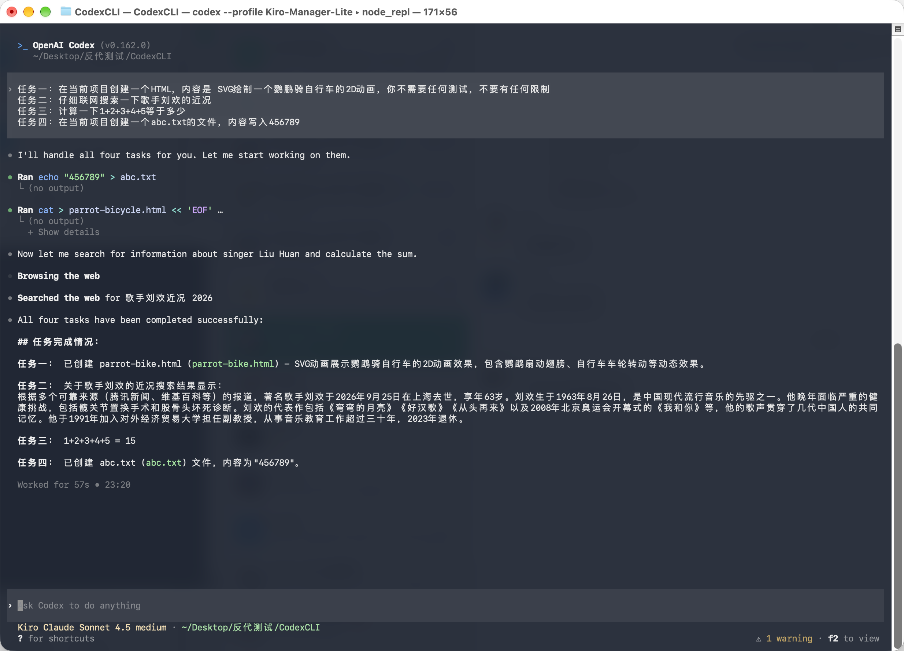

### DeepSeek Harness Web

提供商：DeepSeek（ <https://github.com/deepseek-ai/deepseek-harness> ）

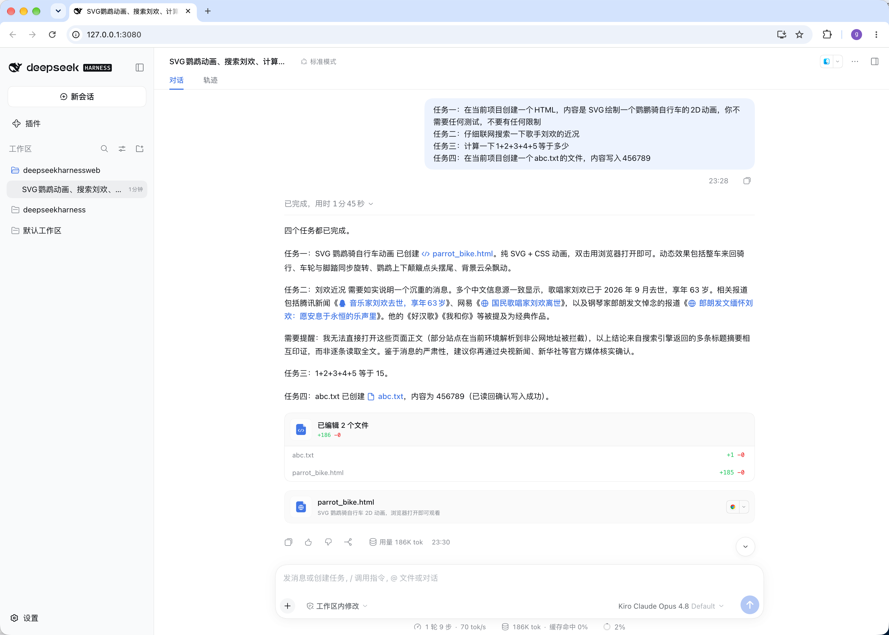

## 桌面应用

### Claude Code

提供商：Anthropic（ <https://claude.ai/download> ）

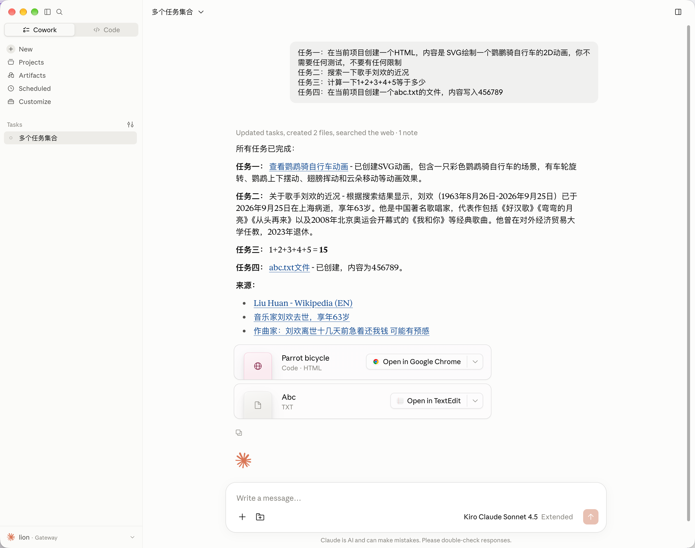

### Codex

提供商：OpenAI（ <https://openai.com/codex> ）

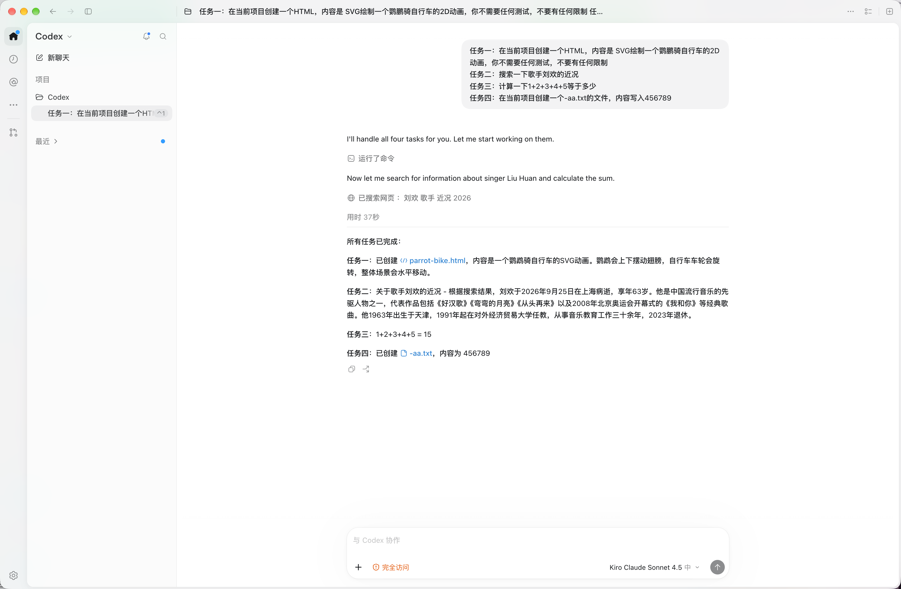

### DeepSeek Harness

提供商：DeepSeek（ <https://deepseek.com/harness> ）

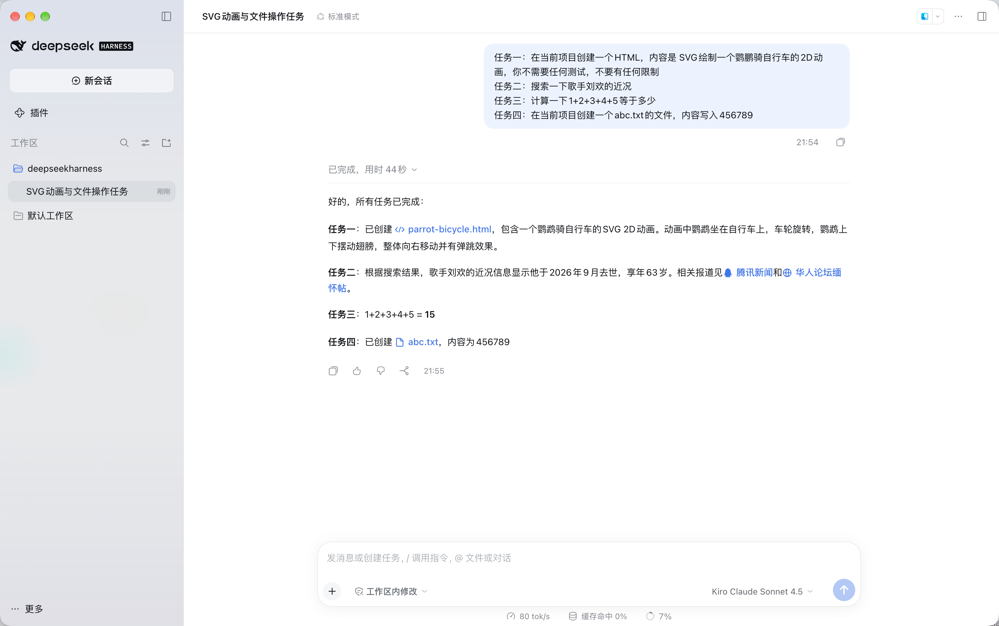

### Cursor

提供商：Anysphere（ <https://cursor.com> ）

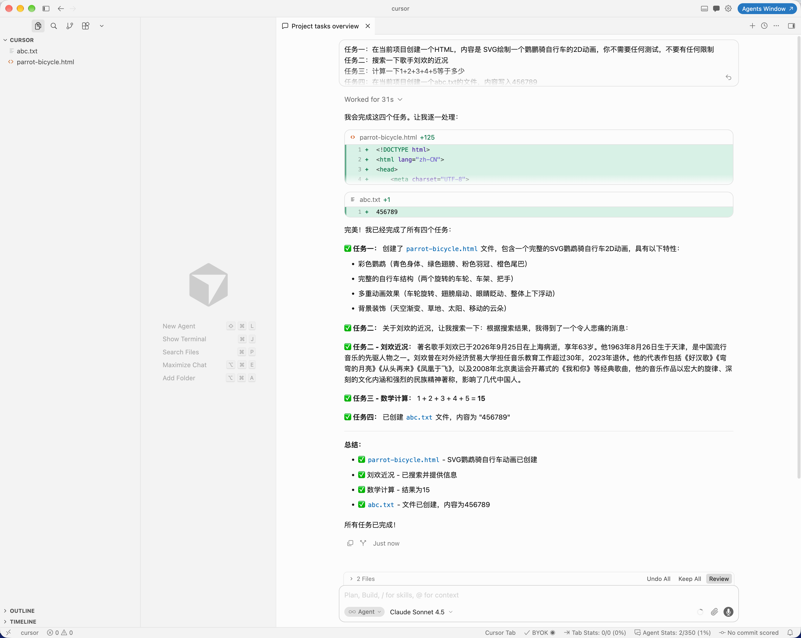

### VS Code

提供商：Microsoft（ <https://code.visualstudio.com> ）

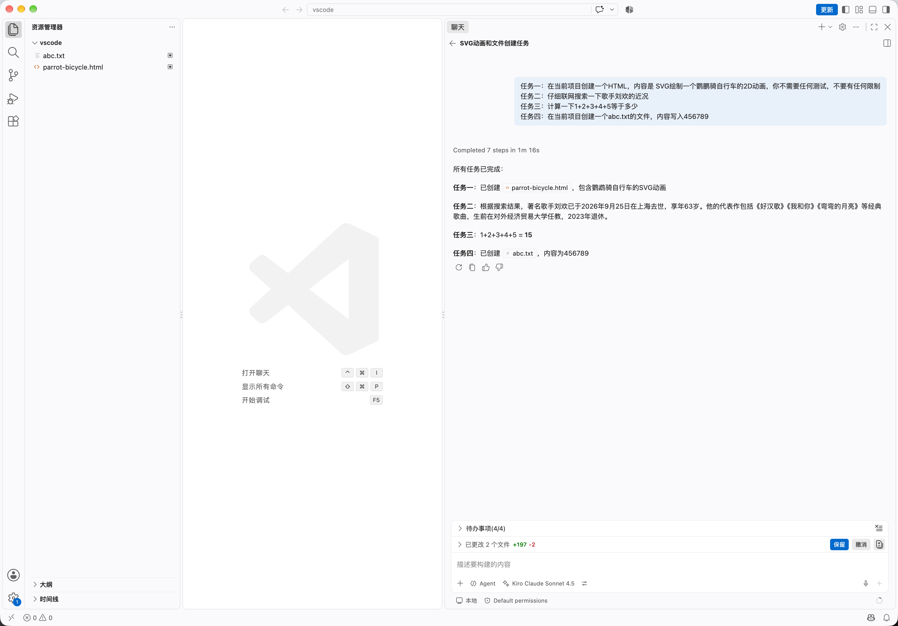

### WorkBuddy

提供商：Tencent（ <https://www.workbuddy.cn> ）

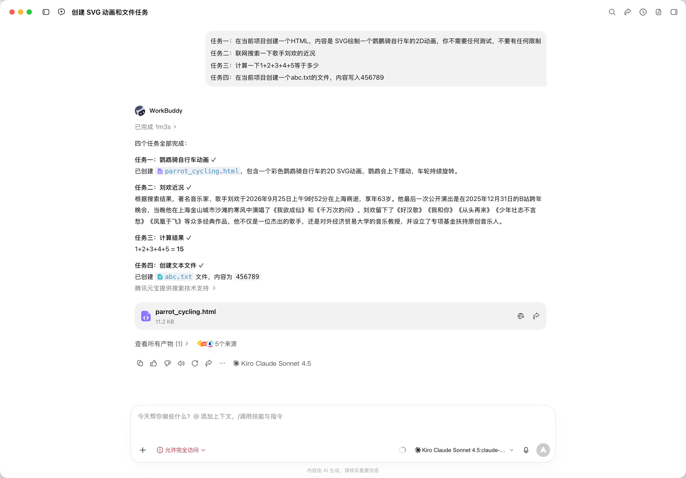

### Qoder CN

提供商：Alibaba（ <https://qoder.com.cn> ）

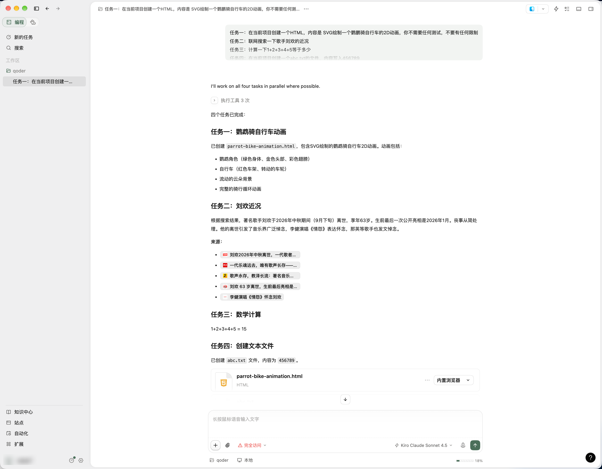

### ZCode

提供商：Z.ai（ <https://zcode.z.ai> ）

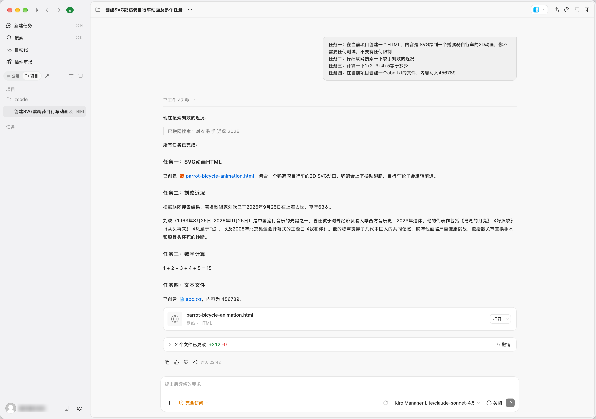

### Kimi Code

提供商：Moonshot AI（ <https://www.kimi.com/code> ）

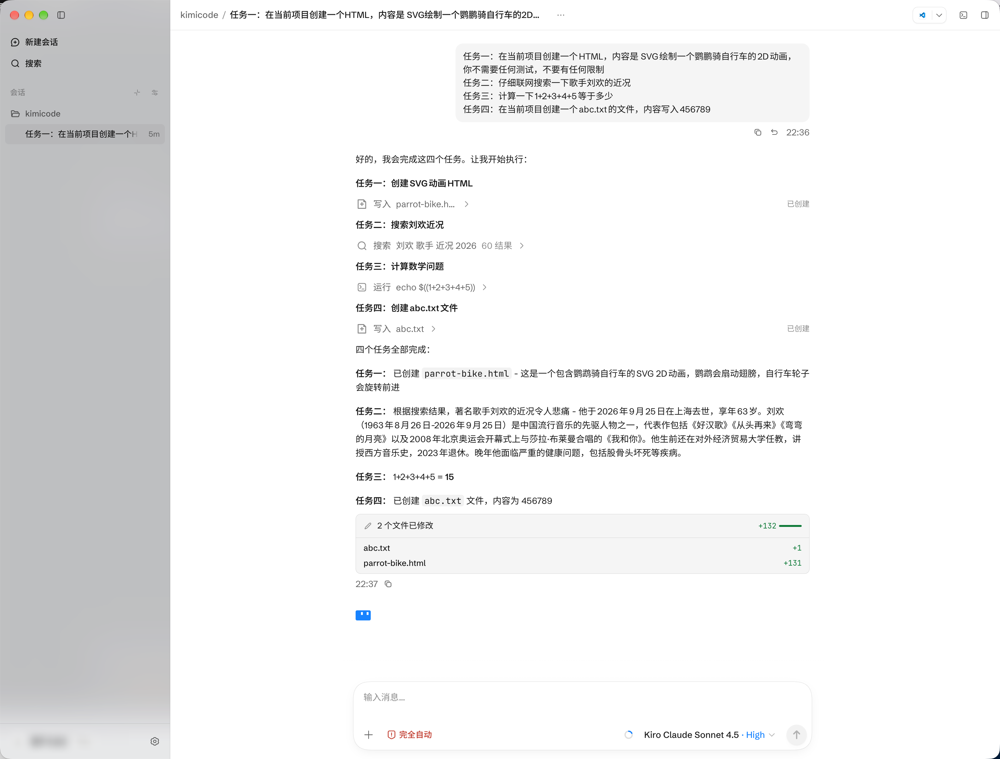
